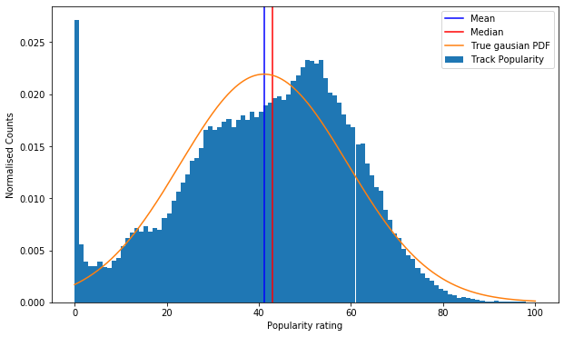
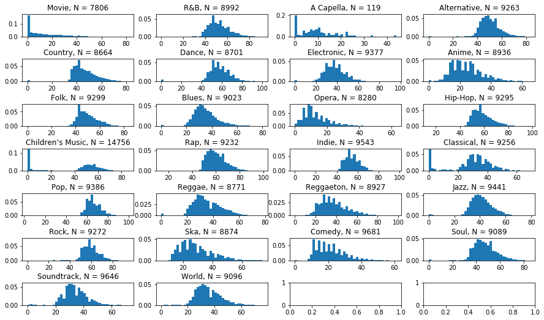
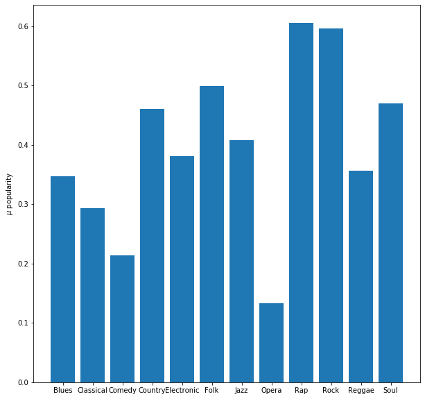
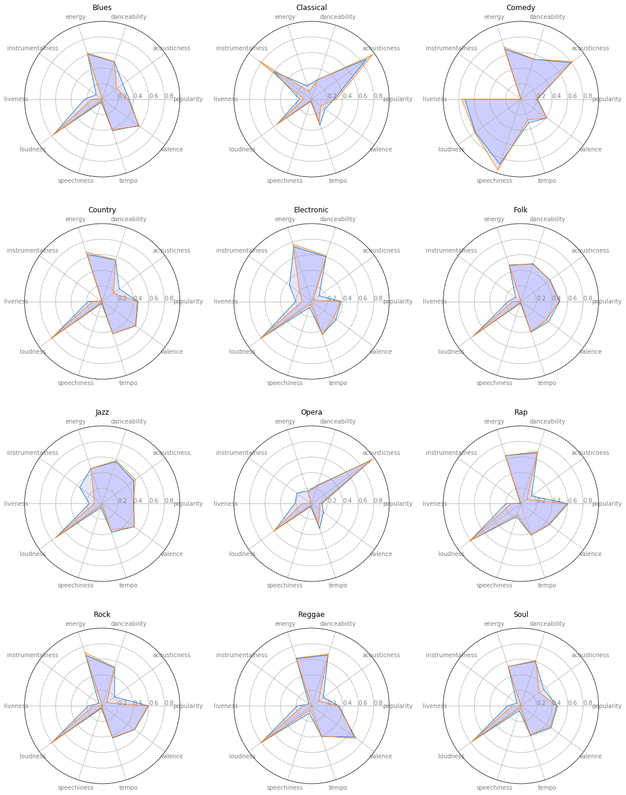
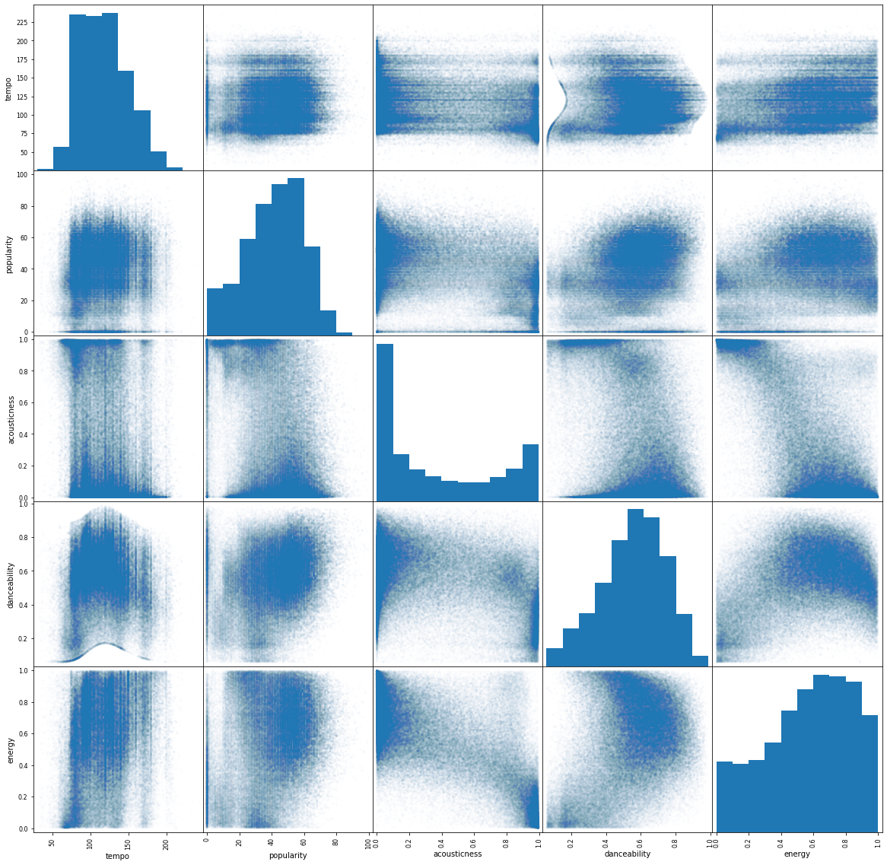
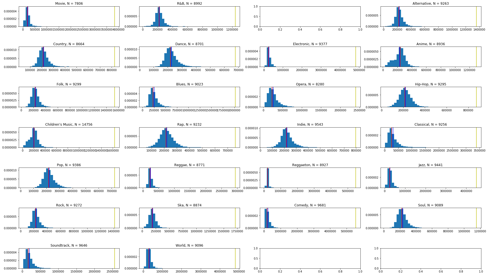

## Visualising the data

As a first step in the preprocessing of the data, a sufficient knowledge of the dataset should be established. The data should be analyzed in regards to both popularity and genre, since those are the features to be predicted from our models. Starting off with the popularity, a histogram is made using matplotlib to gain insight of it's distribution. 

{#popularity_hist width=80%}

It can be seen that the distribution resembles a normal distribution, but deviates significantly in some places. The most notable difference being the big spike in the first bin(a popularity rating of 0), which could have several explanations. It might be that there are simply just a lot of unpopular songs on the plaform, as the data would seem to indicate. Another explanation could be that the popularity score is not calculated by spotify before some criteria is met, e.g. a track has been on the planform for period of time. It depends on how and when the score is computed, when the tracks were put on the platform, all information that the group does not currently have.

Continuing, since the dataset included multiple genres, an assumption of each genre having it's own distribution seems somewhat propable, and as such, the popularity across each genre is plotted, yielding the result as seen below: 

{#popularity_pr_genre width=90%}

From the above, it is seen that the assumption holds somewhat true. Furthermore, a few key insights is gained, namely that the "A Capella" genre only has 119 samples, and only a few genres contains the outliers with a popularity rating of 0, which was seen in the generel histogram. Indirectly, seeing that the feature distribution is somewhat different across genres, this could be examined further. Here, one could examine the means/varianses across genres of different features and plotting these against each other, with an example below of the mean of the popularity for each genre: 

{#unoptimal_mean_pop_genre width=80%}

This process would get rather tiresome to do for each feature, and as such, a radar plot is used instead for each genre, with each plot containing multiple feature means. It should be noted here, that for this to work, the data has been scaled to value between 0 and 1, which is also done in order to improve our models efficiency later. The radar plots yielded the results as seen below: 

{#radar_plot width=80%}

Now, from the above, a distinction between the shapes of the radarplots can be seen, which is good, because in order for classifier to distinguish between genres, their features should differ in some way. 

Now, in moving back to the regressor which was to be used to predict popularity, the correlations between popularity and other features should be analysed. Turning the beforementioned analysis around, where popularity was argued to be somewhat related to genre, the genre feature can be seen as an important feature to predict the popularity from - this leaves the rest of the features to be analysed. To easily visualise the results of these correlations, scikik learns _scatter_matrix()_ is used. Using only some of the features here as an example, the results of running the _scatter_matrix()_ is seen below: 

{#radar_plot width=80%}

Looking above, the popularity does not seem to be correlated much with the other features, which is unfortunate. This result alone leaves the expectation for the regressor rather low, as if there is no correlation, no predictions can be made, e.g if there is no correlation, no mathmatical connection between the to can be made. 

Lastly, before moving on, the "_duration_ms_" feature contained significant outliers, while the feature itself had a huge range.

{#durErr width=80%}

From the above it is seen that each feature had atleast 1 significant outlier for their duration feature, while all being distributed around a somewhat similar mean value. 